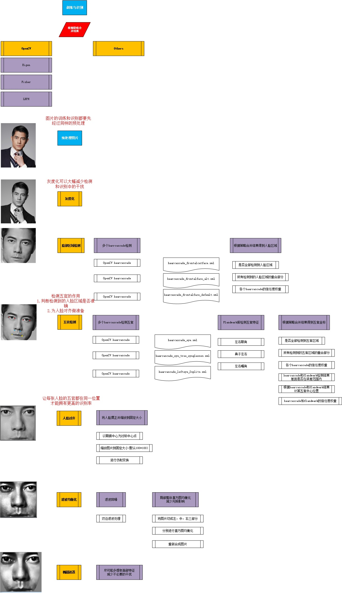

# what's the project

A project for face recogniton writen by c++ and base on OpenCV,boost,flandmark..etc.

It can detects faces in picture and recognizes it in trained face model.

# platform
It's desgined running on both windows and linux.

It can only runs on windows at present, we will support it on linux when it's stable on windows.

# Build:

## for windows:
* we prebuild opencv in third/opencv-3.1.0/build/win, before build vistual studio will uzip lib files
* you also can build it by yourself, and then copy the lib files to third/opencv-3.1.0/build/win/debug[release]/lib  
* then just build code/platform/win/face_recognition.sln with msvc2013
## for linux:
comming soon..

# mechanism

